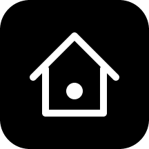

# BrightHome

Home Assistant on the Light Phone III. LightOS shows the tool as **Home**.

## Install via BrightMarket

<p align="center">
  
</p>

Scan the code above with **BrightMarket** installed to open BrightHome there and
install or update it directly. Don't have BrightMarket yet? Get it, and browse
every Bright app, at
**[brightmarket.gzl.dev](https://brightmarket.gzl.dev)**.

**Current release: v1.0.0.** `versionCode` 1, tool id `com.thelightphone.brighthome`.

Part of the [Bright* collection](https://brightmarket.gzl.dev).

## What it does

- **Favorites is the home page.** The four or five things you actually touch, one tap
  from the launcher. Everything else is two.
- **Rooms** groups your entities the way Home Assistant does, resolving each entity's
  area from its own assignment first and its device's second.
- **Scenes** fires scenes, scripts and buttons.
- Live state over the Home Assistant WebSocket, so a light someone else switches off
  updates on the phone without a refresh.
- Toggles, covers, locks and media players; sensors and climate read out but do not
  take a tap.
- Setup is one scanned code. Nothing is typed unless you want it to be.

The tool asks for `INTERNET`, `ACCESS_NETWORK_STATE`, `CAMERA` for the setup scan, and
`VIBRATE`. It asks for nothing else.

## It has to be https

This is the one constraint worth knowing before you start.

A light-sdk tool does not write its own `AndroidManifest.xml` — the SDK's Gradle plugin
generates it from `lighttool.toml`, and rejects the build outright if you ship one by
hand. That generated manifest carries no `usesCleartextTraffic` and no
`networkSecurityConfig`, and on API 34 the platform default is to refuse cleartext. So
`http://192.168.1.x:8123` cannot work here, no matter what you put in the address field.
BrightHome refuses a `http://` address at the pairing step rather than letting it fail
later as an opaque network error.

That leaves TLS, which in practice means a **Cloudflare tunnel**.

## Setting up the tunnel

1. Run the `cloudflared` add-on and point a tunnel hostname at `http://homeassistant:8123`.
2. Tell Home Assistant to trust the proxy, or every request is dropped before it is
   answered:

   ```yaml
   http:
     use_x_forwarded_for: true
     trusted_proxies:
       - 172.30.33.0/24
   ```

3. Put a Cloudflare **Access** application in front of the hostname, so your Home
   Assistant login page is not sitting on the open internet.
4. Create a **service token** and add a policy on that application with the action
   *Service Auth*. Access cannot run its interactive login against an HTTP client, so a
   service token is how an app gets through. BrightHome sends it as
   `CF-Access-Client-Id` and `CF-Access-Client-Secret` alongside the Home Assistant
   bearer token: Access authorises at the edge, Home Assistant authorises at the origin.

Skipping steps 3 and 4 works, and the pairing page will say plainly what you are giving
up.

### The latency, honestly

Every tap round-trips to the Cloudflare edge and back, including when you are standing
in your own kitchen on your own Wi-Fi. That is roughly 100ms to switch on a light fifteen
feet away. BrightHome hides most of it by flipping the row under your finger the instant
you touch it and correcting from the WebSocket a moment later, which is why it feels
local even though it isn't. A local-first race against the LAN address would remove the
round trip, and would also reintroduce the cleartext problem above, so it is not in
v1.0.0.

## Pairing

A long-lived access token is about 180 characters, and a service token adds two more
secrets. Typing that on this keyboard is not a reasonable thing to ask of anyone, so the
whole credential set travels as one scanned QR.

Open [`docs/pair.html`](docs/pair.html) on a computer — double-click it, no server
needed — fill in the four fields, and scan what it draws with **Set up → Scan setup
code**. The page loads nothing and sends nothing: the QR is drawn by an encoder embedded
in the file, so the tokens never leave the browser tab you typed them into.

Manual entry is there as a fallback for when there is no second screen to hand.

Create the Home Assistant token at **your profile → Security → Long-lived access
tokens**. Use an admin account if you want the Rooms tab — the area, entity and device
registries are admin-only, and with a non-admin token BrightHome authenticates fine,
says so in Settings, and puts everything in one list instead.

## What is stored on the phone

The address and both tokens go in the tool's DataStore, along with your favourites.
Nothing else is written and nothing leaves the device except requests to your own
instance. **Forget this instance** in Settings deletes all of it; the long-lived token
stays valid until you revoke it in Home Assistant.

Neither token is ever rendered on screen. When a request is rejected, BrightHome names
*which* credential was rejected — a 403 from Access and a 401 from Home Assistant send
you to re-scan very different things — without showing you either one.

## Building it

It is a light-sdk tool, so the SDK lives in this repo and the tool is one module:

```
./gradlew :examples:BrightHome:assembleDebug
```

Building against the SDK needs a GitHub token with `read:packages` in
`local.properties` as `gpr.user` / `gpr.key`, because `sdk:ui` pulls the Light keyboard
from lightphone's GitHub Packages. A push to `main` builds and publishes a signed APK
and tells BrightMarket about it.

## Release notes

- **v1.0.0** — Initial release. Favorites, Rooms and Scenes over a Cloudflare tunnel;
  QR pairing with Cloudflare Access service token support; live state over the Home
  Assistant WebSocket with optimistic toggling.

## License

MIT, the same as upstream light-sdk. See [LICENSE](LICENSE).

<!-- bright-footer:begin -->
---

## Bright\*

**It's not Light, it's Bright.**

26 open-source apps for the **Light Phone III** — camera, music, maps, messages,
reading, transit, games. The phone has no app store, so they install by sideload: scan one
code from **[brightmarket.gzl.dev](https://brightmarket.gzl.dev)** and BrightMarket keeps them updated.

[Roll](https://github.com/gi-os/Roll) · [BrightNotebook](https://github.com/gi-os/BrightNotebook) · [BrightControl](https://github.com/gi-os/BrightControl) · [BrightWay](https://github.com/gi-os/BrightWay) · [BrightChat](https://github.com/gi-os/BrightChat) · [browse all 26 →](https://brightmarket.gzl.dev)

The Light Phone does not sponsor or endorse any of these. Built by
[Giovanni Lupo](https://github.com/gi-os) — if this one is useful to you, a ⭐ helps the next
person find it.
<!-- bright-footer:end -->
